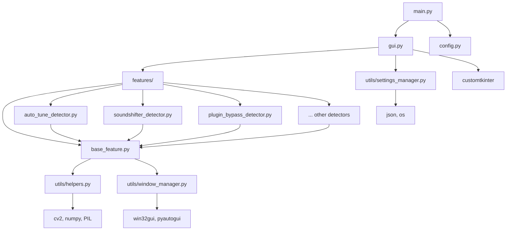

# 🏗️ ARCHITECTURE - Kiến trúc hệ thống Cubase Tools

> **Deep dive vào design patterns, data flow và module dependencies**

---

## 📋 Mục lục

1. [**Tổng quan Architecture**](#-tổng-quan-architecture)
2. [**Module Dependencies**](#-module-dependencies)  
3. [**Design Patterns**](#-design-patterns)
4. [**Data Flow**](#-data-flow)
5. [**Class Hierarchy**](#-class-hierarchy)
6. [**Threading Model**](#-threading-model)
7. [**Error Handling Strategy**](#-error-handling-strategy)

---

## 🎯 Tổng quan Architecture

### High-Level Structure
```
┌─────────────────────────────────────────────────────────────┐
│                     CUBASE TOOLS                           │
├─────────────────────────────────────────────────────────────┤
│  GUI Layer (CustomTkinter)                                 │
│  ├── main.py ─────────────────► Application Entry Point    │
│  └── gui.py ──────────────────► User Interface Controller  │
├─────────────────────────────────────────────────────────────┤
│  Business Logic Layer                                       │
│  ├── features/ ───────────────► Plugin Detector Classes    │
│  │   ├── base_feature.py ────► Abstract Base Class         │
│  │   ├── auto_tune_detector.py ──► Concrete Implementation │
│  │   ├── soundshifter_detector.py ──► Concrete Implementation │
│  │   └── ... (7 other detectors)                          │
├─────────────────────────────────────────────────────────────┤
│  Infrastructure Layer                                       │
│  ├── utils/ ──────────────────► Core Utilities             │
│  │   ├── helpers.py ─────────► Template Matching Engine    │
│  │   ├── window_manager.py ──► OS Integration              │
│  │   ├── process_finder.py ──► Process Management          │
│  │   └── settings_manager.py ► Configuration Management    │
├─────────────────────────────────────────────────────────────┤
│  Configuration Layer                                        │
│  ├── config.py ───────────────► Static Configuration       │
│  ├── settings.json ───────────► Dynamic User Settings      │
│  └── templates/ ──────────────► Image Assets               │
└─────────────────────────────────────────────────────────────┘
```

### 🎨 Design Philosophy

1. **Separation of Concerns**: GUI ≠ Logic ≠ Infrastructure
2. **Template Method Pattern**: Base class define workflow, concrete classes implement details
3. **Dependency Injection**: Utils được inject vào detectors thay vì tight coupling
4. **Configuration-Driven**: Behavior được control bởi settings thay vì hardcode
5. **Fail-Safe Design**: Silent failures, graceful degradation

---

## 🔗 Module Dependencies

### Dependency Graph


### Import Strategy
```python
# Centralized imports in __init__.py files
# utils/__init__.py
from .helpers import TemplateHelper, MouseHelper, OCRHelper
from .window_manager import WindowManager  
from .process_finder import ProcessFinder
from .settings_manager import SettingsManager

# features/__init__.py
from .base_feature import BaseFeature
from .auto_tune_detector import AutoTuneDetector
# ... other detectors
```

---

## 🎭 Design Patterns

### 1. **Template Method Pattern**

**Base Class định nghĩa algorithm skeleton:**
```python
class BaseFeature:
    def execute(self):
        """Template method - workflow chung cho tất cả plugins"""
        if not self._find_cubase_process():
            return False
            
        if not self._find_template_match():
            return False
            
        return self._perform_action()
    
    # Abstract methods - subclasses phải implement
    def _find_template_match(self): pass
    def _perform_action(self): pass
```

**Concrete Classes implement specific logic:**
```python
class AutoTuneDetector(BaseFeature):
    def _find_template_match(self):
        # Auto-Tune specific template matching
        
    def _perform_action(self):
        # Auto-Tune specific click actions
```

### 2. **Strategy Pattern** 

**Template matching strategies:**
```python
class TemplateHelper:
    def match_template(self, template_name, strategy="default"):
        strategies = {
            "default": self._default_match,
            "multi_scale": self._multi_scale_match,
            "rotation_invariant": self._rotation_invariant_match
        }
        return strategies[strategy](template_name)
```

### 3. **Observer Pattern**

**GUI observes detector states:**
```python
class CubaseToolsGUI:
    def __init__(self):
        self.observers = []
        
    def add_observer(self, callback):
        self.observers.append(callback)
        
    def notify_observers(self, event):
        for callback in self.observers:
            callback(event)
```

### 4. **Factory Pattern**

**Detector creation:**
```python
class DetectorFactory:
    @staticmethod
    def create_detector(plugin_type):
        detectors = {
            "auto_tune": AutoTuneDetector,
            "soundshifter": SoundShifterDetector,
            "transpose": TransposeDetector
        }
        return detectors[plugin_type]()
```

---

## 🌊 Data Flow

### 1. **User Action Flow**
```
User clicks button 
    ↓
GUI._execute_detector() 
    ↓
DetectorClass.execute()
    ↓  
BaseFeature template method
    ↓
Concrete implementation
    ↓
Utils (template matching, mouse control)
    ↓
OS API calls (win32gui, pyautogui)
    ↓
Cubase application
```

### 2. **Template Matching Flow**
```
Template image (PNG)
    ↓
cv2.imread() → numpy array
    ↓
Screen capture → PIL Image → numpy array
    ↓
cv2.matchTemplate() → confidence matrix
    ↓
np.unravel_index() → best match coordinates
    ↓
Confidence threshold check (0.9)
    ↓
Return match location or None
```

### 3. **Settings Flow**
```
User changes settings
    ↓
GUI updates widgets
    ↓
SettingsManager.save_settings()
    ↓
JSON serialization → settings.json
    ↓
SettingsManager.load_settings()
    ↓
Detector classes read config
    ↓
Behavior adaptation
```

---

## 👑 Class Hierarchy

### Core Classes UML
```
┌─────────────────────┐
│   BaseFeature       │
│ ─────────────────── │
│ + execute()         │
│ # _find_cubase()    │
│ # _find_template()  │ ← Abstract
│ # _perform_action() │ ← Abstract  
└─────────────────────┘
           ↑
    ┌─────────┴─────────┐
    │                   │
┌───────────────┐ ┌──────────────┐
│ AutoTuneD...  │ │ SoundShift.. │
│ ───────────── │ │ ──────────── │  
│ + raise_tone()│ │ + set_pitch()│
│ + lower_tone()│ │ + get_tone() │
└───────────────┘ └──────────────┘
```

### Utility Classes
```
┌──────────────────┐
│   TemplateHelper │
│ ──────────────── │
│ + match_template()│
│ + get_confidence()│
│ - _load_template()│
└──────────────────┘

┌──────────────────┐
│   MouseHelper    │
│ ──────────────── │
│ + safe_click()   │
│ + double_click() │
│ + restore_cursor()│
└──────────────────┘

┌──────────────────┐
│  WindowManager   │
│ ──────────────── │
│ + find_window()  │
│ + focus_window() │
│ + get_rect()     │
└──────────────────┘
```

---

## ⚡ Threading Model

### Thread Architecture
```
Main Thread (GUI)
├── UI Event Handling
├── Widget Updates  
└── User Interactions

Worker Threads
├── Template Matching (CPU intensive)
├── Screen Capture (IO intensive)
└── File Operations (IO intensive)

Auto-Detection Thread  
├── Background Monitoring
├── Periodic Checks
└── State Updates
```

### Thread Safety Mechanisms
```python
class BaseFeature:
    def __init__(self):
        self._lock = threading.Lock()
        self._running = False
        
    def execute(self):
        with self._lock:
            if self._running:
                return False
            self._running = True
            
        try:
            return self._do_execute()
        finally:
            with self._lock:
                self._running = False
```

---

## 🛡️ Error Handling Strategy

### Error Hierarchy
```
CubaseToolsError (Base)
├── TemplateNotFoundError
├── CubaseNotFoundError  
├── WindowFocusError
└── ConfigurationError
```

### Error Handling Layers

1. **Silent Layer** (Utils level):
```python
def find_template(self, template_name):
    try:
        return self._match_template(template_name)
    except Exception:
        return None  # Silent failure
```

2. **Logging Layer** (Feature level):
```python  
def execute(self):
    try:
        return self._do_execute()
    except Exception as e:
        logger.error(f"Detector failed: {e}")
        return False
```

3. **User Feedback Layer** (GUI level):
```python
def _execute_detector(self):
    success = detector.execute()
    if not success:
        self._show_error_message("Operation failed")
```

### Graceful Degradation
- **Template missing** → Use alternative detection method
- **Cubase not found** → Show helpful error message  
- **Permission denied** → Suggest running as admin
- **Screen capture failed** → Retry with different method

---

## 📈 Performance Considerations

### Template Matching Optimization
1. **Template Caching**: Load templates once, reuse multiple times
2. **ROI Selection**: Match chỉ trong region of interest thay vì full screen
3. **Multi-scale Matching**: Handle different DPI settings
4. **Async Processing**: Template matching trong background thread

### Memory Management  
```python
class TemplateHelper:
    _template_cache = {}  # Class-level cache
    
    def _load_template(self, name):
        if name not in self._template_cache:
            self._template_cache[name] = cv2.imread(f"templates/{name}")
        return self._template_cache[name]
```

### CPU Usage Optimization
- **Debouncing**: Prevent rapid-fire executions
- **Sleep Intervals**: Add delays between operations
- **Priority Queuing**: Critical operations first

---

## 🔮 Extensibility Points

### Adding New Plugin Detector
1. **Inherit from BaseFeature**
2. **Implement abstract methods**  
3. **Add template images**
4. **Register in GUI**
5. **Update configuration**

### Adding New Utility
1. **Create in utils/ directory**
2. **Follow naming convention**
3. **Add to __init__.py**
4. **Write unit tests**
5. **Update documentation**

### Customizing Behavior
- **Settings.json**: User-configurable parameters
- **Config.py**: Developer-configurable constants  
- **Template replacement**: Custom plugin templates
- **Hook system**: Pre/post execution callbacks

---

*💡 **Architecture Philosophy**: "Simple things should be simple, complex things should be possible"*